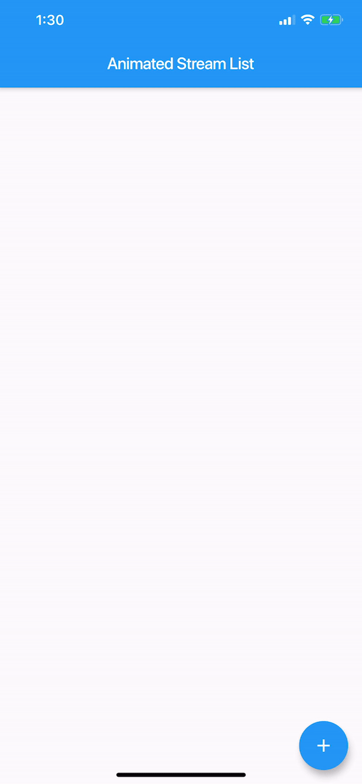

  
# Animated Stream List    
 A Flutter library to easily display a list with animated changes from a ```Stream<List<E>>```.    
It's like ```StreamBuilder + ListView.Builder``` with animations.    
Taken inspiration from the [Animated List Sample](https://flutter.dev/docs/catalog/samples/animated-list) and [Java-diff-utils](https://github.com/KengoTODA/java-diff-utils) 



```dart 
// create tile view as the user is going to see it, attach any onClick callbacks etc. 
Widget _createTile(String item, Animation<double> animation) {    
 return SizeTransition(      
    axis: Axis.vertical,      
    sizeFactor: animation,      
    child: const Text(item),    
  ); 
}

// what is going to be shown as the tile is being removed, usually same as above but without any 
// onClick callbacks as, most likely, you don't want the user to interact with a removed view 
Widget _createRemovedTile(String item, Animation<double> animation) {    
 return SizeTransition(      
    axis: Axis.vertical,      
    sizeFactor: animation,      
    child: const Text(item),    
  ); 
}

final Stream<List<String>> list = // get list from some source, like BLOC  
final animatedView = AnimatedStreamList<String>(      
  streamList: list,      
  itemBuilder: (String item, int index, BuildContext context, Animation<double> animation) =>      
    _createTile(item, animation),      
  itemRemovedBuilder: (String item, int index, BuildContext context, Animation<double> animation) =>  
    _createRemovedTile(item, animation), 
  ); 
} 
 ```    
 
 ## Getting Started   
 

#### 1. Add dependency to your  `pubspec.yaml`

```yaml
dependencies:
  animated_stream_list: ^0.0.4
```
#### 2. Import it

```dart
import 'package:animated_stream_list/animated_stream_list.dart';
```

#### 3. Use it. See the examples folder for an ... example.
  
## Parameters
   
```dart 
@required Stream<List<E>> streamList;  
```

```dart 
@required AnimatedStreamListItemBuilder<E> itemBuilder; 
@required AnimatedStreamListItemBuilder<E> itemRemovedBuilder; 
```   

`AnimatedStreamListItemBuilder<T>` is just a function which builds a tile    
  
```dart 
typedef Widget AnimatedStreamListItemBuilder<T>(
  T item,
  int index,
  BuildContext context,
  Animation<double> animation,
); 
```   

## Options  
  
```dart 
Equalizer equals; 
```   

Compares items for equality, by default it uses the `==` operator, it's **critical** this works properly.    
    
`Equalizer` is function, that, given two items of the same type, returns true if they are equal, false otherwise  
    
```dart 
typedef bool Equalizer(dynamic item1, dynamic item2); 
```    

 You can check the [Animated List Documentation](https://docs.flutter.io/flutter/widgets/AnimatedList-class.html) for the rest:    
  
```dart 
Axis scrollDirection; 
```
```dart
bool reverse; 
```
```dart
ScrollController scrollController; 
```
```dart
bool primary; 
```
```dart
ScrollPhysics scrollPhysics; 
```
```dart
bool shrinkWrap; 
```
```dart
EdgeInsetsGeometry padding; 
```
